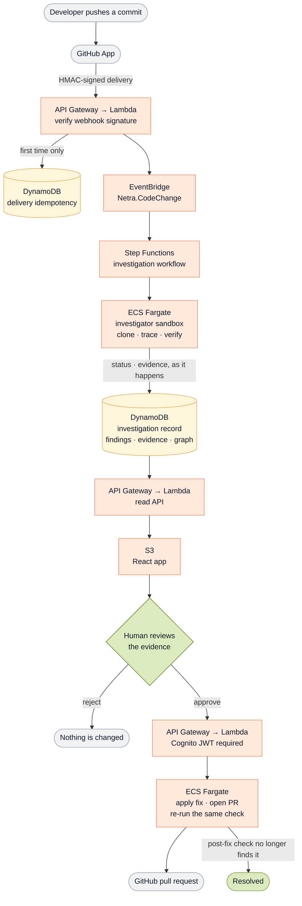

# Netra

**Netra investigates the consequences of code changes before they become incidents.**

> LLMs investigate. Deterministic code verifies. Humans authorize.

A diff can be five lines and still publish a credential. Code review asks *is this correct?* Scanners ask *does this contain a known vulnerability?* Netra asks a different question:

> **What can this change reach, and can we prove it?**

Built for the **AWS First Commit Hackathon** · Region `eu-north-1` · Deployed with AWS SAM.

**🔗 Live demo → [netra-prod-web-421946397122.s3-website.eu-north-1.amazonaws.com](http://netra-prod-web-421946397122.s3-website.eu-north-1.amazonaws.com)**

---

## What it does

A push to a monitored repository starts a real investigation. Netra clones the commit into an isolated sandbox, traces what the change can reach, and records evidence for every claim. When it proves an exposure, it stops and asks a human. Only after approval does it open a pull request — and only after re-running the same check against the fixed commit does it mark the investigation resolved.

Nothing is simulated. Where a capability is unavailable, the UI says so rather than pretending it ran.

---

## AWS architecture



*Green marks the human decision and the verified end state — no path reaches remediation without the first, and none reaches `Resolved` without the second. Every stage writes to the investigation record as it goes, which is what the UI polls. Supporting services (ECR, Secrets Manager, SQS, CloudWatch) are in the table below rather than drawn, to keep the main path readable.*


### AWS services used

| Service | Role in Netra |
|---|---|
| **API Gateway** (HTTP API) | Three endpoints: GitHub webhook receiver, investigation read API, and the approval API — the last protected by a **Cognito JWT authorizer** |
| **AWS Lambda** | Webhook receiver, three workflow steps (create / confirm / record-failure), the approval handler, and the Fastify read API |
| **Amazon EventBridge** | `Netra.CodeChange` custom bus decoupling ingest from analysis, with an **event archive** for replay |
| **AWS Step Functions** | The investigation workflow: create → run → confirm → approval branch, with retries, a 30-minute task timeout, and a catch-all failure path |
| **Amazon ECS on Fargate** | Runs the investigator as an ephemeral, unprivileged container — the sandbox boundary for cloning and analyzing untrusted code |
| **Amazon ECR** | Hosts the ARM64 investigator image (Graviton) |
| **Amazon DynamoDB** | Two tables: webhook **delivery idempotency** (conditional writes), and a single-table investigation store (`pk=INV#<id>`) |
| **Amazon S3** | Static hosting for the React single-page app |
| **Amazon Cognito** | Google-federated sign-in; the `sub` claim is the only accepted approver identity |
| **AWS Secrets Manager** | GitHub App private key, webhook secret, model API keys — never in source, logs, or the frontend bundle |
| **Amazon SQS** | Dead-letter queue for events the pipeline could not accept |
| **Amazon CloudWatch** | Structured logs for every component, plus an alarm on webhook errors |
| **AWS SAM / CloudFormation** | The whole stack as IaC in `infra/template.yaml` |
| **AWS IAM** | Scoped task, execution, Lambda, Step Functions and EventBridge roles |

> **No Amazon Bedrock.** Model calls go through a provider-agnostic router (OpenRouter, with a local Ollama fallback). When no model is reachable, the pipeline runs deterministic-only and labels the report accordingly — the security conclusion never depends on an LLM.

---

## The trust model

The pipeline is arranged so that the three roles cannot be confused:

| Role | Who does it | Enforcement |
|---|---|---|
| **Investigate** | The LLM proposes hypotheses and narrative | Can only call allowlisted tools; may never set a verification status |
| **Verify** | Deterministic analyzers (`secret-flow-v1`) | Only code can write `VERIFIED`; every finding cites a file, a line and the check that proved it |
| **Authorize** | A signed-in human | No transition reaches `REMEDIATING` except through `AWAITING_APPROVAL`; approver identity comes from the Cognito JWT `sub`, never the request body |

`RESOLVED` is never granted because a patch applied cleanly. The same analyzer re-runs against the new commit, and the `POST_FIX` verification record is written *before* the status — so no reader can see `RESOLVED` without the evidence behind it.

---

## Repository layout

```
apps/web                 React + TypeScript + Tailwind SPA
services/api             Fastify read API (Lambda)
services/webhook         GitHub webhook receiver (Lambda)
services/orchestrator    Step Functions task handlers + approval (Lambda)
services/investigator    Python analysis engine (ECS Fargate)
packages/domain          Shared typed domain model
infra/                   AWS SAM template + state machine definition
```

---

## Running it

```bash
pnpm install
pnpm typecheck && pnpm test                    # TypeScript services
cd services/investigator && uv sync && uv run pytest    # analysis engine
pnpm --filter @netra/web dev                   # UI against a local API
```

Deploy the stack:

```bash
sam deploy --config-env prod --template-file infra/template.yaml \
  --parameter-overrides Stage=prod CognitoUserPoolId=<pool> CognitoClientId=<client> ...
```

Pre-created IAM roles are passed in as parameters because the deploying principal has `PowerUserAccess`, which cannot create roles. No secret is ever passed on the command line — production credentials live in Secrets Manager.

---

## Current limitations

Stated plainly, because a security tool that overstates itself is worse than one that does less:

- **One analyzer.** `secret-flow-v1` proves credential exposure and sensitive secret flow. The fixture repository also contains authorization, dangerous-input and security-config examples; no analyzer reports those yet, and Netra does not pretend otherwise.
- **One finding per investigation.** The pipeline currently surfaces the most severe exposure rather than a list.
- **Live updates are polled, not pushed.** The UI re-reads the investigation record every 2.5s with backoff. Server-sent events work locally but are buffered by Lambda in production.
- **Per-file change counts are recorded from the run onward.** Investigations analyzed before that was added show no file list.

